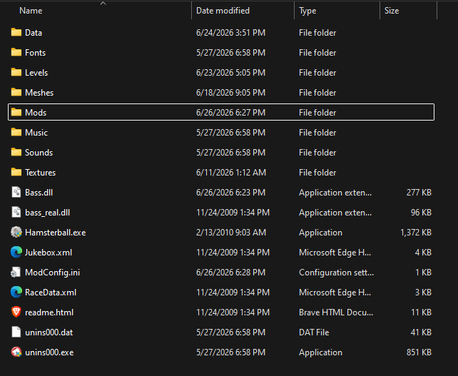

# Hamsterball Plus Modding API


  
Hamsterball Plus is a C++ modding framework for the retro video game _Hamsterball_ using DLL proxying and MinHook. This project creates a modding standard for the community; allowing players to easily install mods, while allowing modders to easily create mods that can coexist.


## Technical Overview

- **Function Hooking**: Uses x86 API hooking via MinHook to inject additional code into the game.
- **Data Structure Mapping**: Reverse engineered the game's objects (App, Ball, Scene, etc.) to expose them to modders.
- **Polling Optimizations**: Uses a checksum based caching system to update references to the players and enemies in order to avoid expensive array repopulation logic.
- **Efficient Memory Management**: Uses "swap and pop" system for the `Hooked_RenderTextLoop` in order to discard expired UI messages in O(1) time complexity.
- **Reverse engineering functions**: Reverse engineered enemy spawning in order to allow the player to dynamically spawn them, when the game originally loaded them from a level file.

## How to install

1. Download the HamsterBallPlus.zip from the [latest release](https://github.com/artizard/Hamsterball-Plus/releases)
2. Extract HamsterBallPlus.zip
3. Go to your Hamsterball folder (Your path is likely something like this: C:\Program Files (x86)\Raptisoft\Hamsterball\\) and rename `bass.dll` to `bass_real.dll`
4. Drop the contents of the extracted folder into your Hamsterball folder.
5. Right click on the Hamsterball.exe and go to properties.
6. On the compatibility tab, check off "Run this program as an administrator". (This is needed in order to modify the .ini file as well as to run custom maps)
7. You've installed Hamsterball Plus, and everything should be working. From here, you can simply place new mods within the \Mods folder. To uninstall mods just delete the .dll file from the \Mods folder.

Your file structure should now look something like this:


## Editing Custom Controls

1. Open ModConfig.ini in a text editor
2. Locate the specific control you want to change within the [Custom Controls] section
3. Swap the hex code to your desired keycode. The hex should correspond to [DirectInput 8 Key Codes](https://gist.github.com/tracend/912308).
4. If you want the keybind to require ctrl to be pressed as well (ex. ctrl+v), add 'CTRL+' to the beginning of the id like so: `EXAMPLE_CODE=CTRL+0x10`

This system will later be improved to have a proper user interface when the eventual mod loader is made. You'll notice that there is also the [Unused Controls] section. This is for controls from mods that are no longer installed. This saves the old controls in case you decide to reinstall the mod. You are free to delete these if you want.

> **This is the end of the guide for players. If you are interested in creating mods, then continue on with the rest of the tutorial.**

# Modders Guide

### Theme & Level Configuration

Leave these sections blank in `ModConfig.ini` to use the game's default values.

| Section & Setting        | Expected Value    | Description                                                                                                                                                                 |
| :----------------------- | :---------------- | :-------------------------------------------------------------------------------------------------------------------------------------------------------------------------- |
| **[Config] Section**     |                   |                                                                                                                                                                             |
| `ShowConsole`            | Boolean (0 or 1)  | Shows the console. I recommend this for debugging; there are some error messages that the modding API will automatically show, but using printf() for testing is essential. |
| **[Theme] Section**      |                   |                                                                                                                                                                             |
| `MenuBody[R/G/B/A]`      | Float (0.0 - 1.0) | Controls the RGBA color of the options and time trial menus.                                                                                                                |
| `MenuHeader[R/G/B/A]`    | Float (0.0 - 1.0) | Controls the RGBA color of the menu headers.                                                                                                                                |
| **[#] (Level) Section**  |                   | _Note: [#] corresponds to the level ID (e.g., [0] is warmup race)._                                                                                                         |
| `RaceName` / `ArenaName` | String            | Overrides the display name of the race and its corresponding arena.                                                                                                         |
| `Color[R/G/B]`           | Float (0.0 - 1.0) | The color of the level's text in the time trial menus.                                                                                                                      |
| `Blot[R/G/B]`            | Float (0.0 - 1.0) | The color of the time blot (the shape around the timer) for this specific level.                                                                                            |

## ModConfig.ini

**[Config] Section**  
`ShowConsole`: 1 = On, 0 = False. This is really useful for debugging. There are some error messages that the modding API will automatically show, but using printf() for testing is essential.

**[Theme] Section**  
Leave this section blank if you want to use the game defaults.  
`MenuBodyR`, `MenuBodyG`, `MenuBodyB`, `MenuBodyA` Control the color of the options and time trial menu using float values from 0.0-1.0  
`MenuHeaderR`, `MenuHeaderG`, `MenuHeaderB`, `MenuHeaderA` Control the color of the the header to many menus using float values from 0.0-1.0

**[#] (Level) Section**  
Leave this section blank if you want to use the game defaults.
The number in the section corresponds to the level, [0] is warmup race, [1] is beginner race, etc.  
`RaceName` The name of the race  
`ArenaName` The name of the corresponding arena  
`ColorR`, `ColorG`, `ColorB` The color of the level's text in the time trial menus.
`BlotR`, `BlotG`, `BlotB` The color of the the time blot (the shape around the timer) for this specific level

**[Custom Controls] and [Unused Controls] Section**  
This stores the keybind for all of the custom controls that mods use. The entries are created and handled by the modding API itself, so you will not ever need to create new entries. As shown in the "Editing Custom Controls" section, you can change the keybinds. If the keybind has "ctrl+" before the hex code, then the keybind requires ctrl to also be pressed. The unused controls section is used for storing controls for mods that are not currently loaded in. If a user uninstalls a mod, their keybinds will be saved for in case they reinstall the mod. The controls will automatically be moved to their correct section.

**[Toggle Buttons] and [Unused Toggle Buttons] Section**  
These entries store the values for the custom toggleable options. 1=on, 0=off. Just like with the controls sections, these entries will be saved in their unused section when not in use.

**[Sliders] and [Unused Sliders] Section**  
These entries store the float values of the custom sliders. Just like the controls and toggle button sections, these entries are dynamically stored in their used/unused sections.

## How To Make Mods

1. Download the HBmodTemplate.zip file, and place it in your Visual Studio template folder. The path of that is typically `C:\Users\[YourName]\Documents\Visual Studio\Templates\ProjectTemplates`. DO NOT EXTRACT THE ZIP FILE
2. Create a Visual Studio project using that template.
3. Rename the fields that are labeled for renaming in MainModFile.cpp. This includes the class name (which needs to be renamed at the top and bottom of the file), the string within GetModName(), and the string within GetAuthorName(). Additionally, you can rename MainModFile.cpp but that is optional.
4. This project will be for a single DLL mod that will eventually go in the \Mods folder. Use the functions and structs from HamsterballAPI.h. The following sections go over the major topics, but there are many topics that are not covered here, and are instead covered by the comments for each function/struct/field.

### Prerequisite knowledge

To use this modding API, I recommend having experience with c++. If you want to implement things that are not natively mapped out in the API, then I recommend learning some reverse engineering tools such as Cheat Engine and Ghidra.

### Base files overview

To create mods, there are two main files you will use: HamsterballAPI.h and MainModFile.cpp. MainModFile.cpp is the file where you will write your code, you should NEVER change anything in HamsterballAPI.h. Additionally, ensure that your version of HamsterballAPI.h is the most up to date version that has been released (Should be version 1). MainModFile.cpp is the main file for the mod, however you can still create more files for helper functions, etc. You should not remove any of the original code from this file, you should just build off of it. I will now go each relevant thing within the base MainModFile.cpp

#### MainModFile.cpp

- `const char* GetModName() override { return "PUT YOUR MOD NAME HERE"; }` This is a required function which returns the name of your mod. Make sure to rename the string in the return.
- `const char* GetAuthorName() override { return "PUT YOUR NAME HERE"; }` Similarly, this is a required function which returns your name. Make sure to rename it. In the header file, you will notice a function called GetContributors(). Add this one as well if there are any other people who helped you with the mod, but that function is not required to compile.
- `int GetApiVersion() override { return HAMSTERBALL_API_VERSION; }` DO NOT EDIT THIS. Future versions of mod (the bass.dll) will not be compatible with DLLs that were originally compiled with an older version. (They will need to be recompiled with the new HamsterballAPI.h). This function helps with tracking the versions that a DLL was built with.
- `void Initialize(IModAPI* modApi) override {}` This is the function that will run when the mod is initially loaded. Put the code that you want to run at the start here.
- `private: IModAPI* api = nullptr;` and `api = modApi;` This initalizes the `api` field, which is an instance of the IModAPI class, which is how you will do most interactions with the game.
- `extern "C" __declspec(dllexport) HamsterballAPI* CreateModInstance() { return new REPLACE_WITH_YOUR_MOD_NAME();}` This is boiler plate code related to loading DLL files that you need to keep here. Do not change this code, just leave it at the bottom of your file.

#### HamsterballAPI.h

- All of functions and structs are commented, so you can find more information about them there.
- You will use IModAPI (the api field) to directly interact with the game by calling the functions within. For the functions within the HamsterballAPI class, you will override them instead of calling them. In general, the HamsterballAPI functions are for doing something when something happens in the game, IModAPI functions are more for retrieving values from the game or doing actions in game.
- The file also contains structs. There are two main kinds: ones for calling functions, and ones that map to objects from the game.
- The Color, CustomButton, CustomSlider, CustomText, and CustomControl structs are used for calling the functions. I went with this approach as many of the fields have default values, so this is generally easier for the modder.
- The header file has several structs map to game objects. Some of the structs' fields are commented, but many of them are self explanatory. You will notice that many of these structs have padding fields. These are unmapped memory regions within the game object. With that being said, there are likely some fields that are missing, that are stored somewhere in the padding. If you find some that you can verify, please let me know and I will add them to a future version of the API. Many of these fields are also labeled as unverified. These are ones that I'm not 100% sure on, especially the ones that map to some other class that I have not mapped out at all. It's also worth noting that some of these fields can be read from but not written to. I've tried to comment those, but there are likely some that were missed.

| Struct           | How to Get               | Description                                                                                                                                                                                                                                                                                                                                                   |
| :--------------- | :----------------------- | :------------------------------------------------------------------------------------------------------------------------------------------------------------------------------------------------------------------------------------------------------------------------------------------------------------------------------------------------------------ |
| App              | GetApp()                 | App is a global object that the game uses for many settings, unlocks, and references to other game objects.                                                                                                                                                                                                                                                   |
| Ball             | GetPlayer()/GetEnemies() | The Ball object is what represents a player or badball (and the funball on sky race). The playerID field determines what the ball is: (-1: enemy, 0: player 1, 1: player 2, 2: player 3, 3: player 4).                                                                                                                                                        |
| PhysicsObject    | Ball->physics_object     | Each Ball contains a PhysicsObject which contains many other useful fields such as velocity and gravity.                                                                                                                                                                                                                                                      |
| Scene            | GetScene()               | The scene object represents the current level in play. This has many fields such as camera options, scores, the current balls in the level, etc.                                                                                                                                                                                                              |
| PhysicsConstants | GetPhysicsConstants()    | PhysicsConstants is largely unmapped, but it contains some friction settings and other miscellaneous global settings. It's worth noting that I had to use VirtualProtect in order to unlock this memory for writing (even though this wasn't a problem with Cheat Engine), so it's possible the same will have to be done with other fields in other structs. |
| Sounds           | App->sounds              | Contains sounds that you can play with the API functions.                                                                                                                                                                                                                                                                                                     |
| Fonts            | App->fonts               | The different fonts that you can use when drawing text. Keep in mind that this does not instantly initialize when the game is launched, so if you try to acquire this in your mod's Initialize() function, you will get a nullptr.                                                                                                                            |

The following section goes over many of the important things to know for modding, however you should read about most of the functions from the comments within HamsterballAPI.h. Additionally, I recommend looking at the included mod files for more example code.

### Creating and using custom controls

The game handles inputs through DirectInput 8 keycodes. Instead of hardcoding the keycode for hotkeys, I've created a system for custom controls which can be rebinded. You create a control with its own ID and a default value, and then it can be rebound through the ModConfig.ini file. To create these, use `RegisterCustomControl()` within the Initialize() function in your mod. For the ID, make sure to choose something that clearly tells the user what it does, while also making it unique enough that other mods are unlikely to use it. If another mod uses the same ID then there can be conflicts, so choose carefully. For setting the default keycode, you will use the CustomControl struct. This allows you to configure whether or not it is a ctrl+ keybind (such as ctrl+v). For non ctrl keybinds, you can also just pass in the keycode directly. For the keycode you can use the constants such as DIK_R, DIK_LSHIFT, etc., or the hex values from [here](https://gist.github.com/tracend/912308). To use these in your mod, you'll use the `WasControlPressed()`, `WasControlReleased()`, or `IsControlDown()` function. Put this in an if statement in either onBallUpdate() or onGameUpdate(). If the control is for something that should be able to be called while in level or in menu, use onGameUpdate(). onBallUpdate() only polls while you are in the level, but it is good for player/ball specific things. Just keep in mind that onBallUpdate() polls for each ball, not just the player. You can also use `GetCustomControlKey(id)` in order to see what the control is bound to. Here is an example of creating and using custom controls:

```cpp
void Initialize(IModAPI* modApi) override {
  // some different ways of calling the function
  api->RegisterCustomControl("jump", DIK_LSHIFT);
  api->RegisterCustomControl("GROW_PLAYER", CustomControl(DIK_G, true));
  api->RegisterCustomControl("releasePrint", 0x19);
}
void onBallUpdate(Ball* playerObject) override {
  if (api->WasControlPressed("jump")) {
    // jump logic goes here
  }
  if (api->IsControlDown("GROW_PLAYER")) {
    api->GetPlayer()->radius += 1;
  }
}
void onGameUpdate() override {
  if (api->WasControlReleased("releasePrint")) {
    printf("Released key: %d", GetCustomControlKey("releasePrint"));
  }
}
```

### Creating new options in the options menu

The modding API allows you to add new options to the game's option menu. They come in two types: Toggle Buttons and Sliders.

#### Toggle buttons

Toggle buttons are binary (on/off) buttons. These are great for allowing the user to toggle certain mods (no break is a good example). To create these, use `CreateToggleButton()` within the Initialize() function of your mod. To call this, you will create a `CustomButton` struct. Many of the fields are optional, so consult the comments to determine what you want to change. When calling CreateToggleButton(), you will have to pass in 'this' as the second argument. To check whether or no the button is toggled, use `GetButtonState(id)`. If you want some logic to run when a button is toggled (such as a byte patch), put that logic inside of `onButtonToggle()`, and handle the logic there for each button that could be clicked.

#### Sliders

Sliders are options that allow you to select a specific decimal number. These are controlled by the arrow keys. To create these, use `CreateSlider()` within the Initialize() function of your mod. Just like the toggle buttons, you will create a struct to call it with; `CustomSlider`. You will also have to pass in 'this' as the second argument for CreateSlider(). To check the value of the slider, use `GetSliderState(id)`. For running logic when a slider is changed, use `onSliderChange()` similarly to onButtonToggle().

#### Code Example (simplified version of jump mod)

```cpp
void Initialize(IModAPI* modApi) override {
    api = modApi;
    api->RegisterCustomControl("jump", DIK_LSHIFT);

    CustomButton jumpButton("CHEAT_JUMP", "JUMPING");
    jumpButton.trueText = "ON";
    jumpButton.falseText = "OFF";
    api->CreateToggleButton(jumpButton, this);

    CustomSlider jumpHeightSlider("JUMP_HEIGHT", "JUMP HEIGHT", 10.0f);
    jumpHeightSlider.stepSize = .25;
    jumpHeightSlider.lowerBound = 0;
    api->CreateSlider(jumpHeightSlider, this);
}

void onBallUpdate(Ball* playerObject) override {
    if (api->GetButtonState("CHEAT_JUMP")) {
        if (api->WasControlPressed("jump")) {
            float jumpHeight = api->GetSliderState("JUMP_HEIGHT");
            playerObject->physics_object->velocity_y = jumpHeight;
        }
    }
}

void onButtonToggle(const char* buttonId, bool newState) override {
  if (strcmp(buttonId, "jump") == 0) {
    printf("Jumping mode toggled.\n");
  }
}
```

### Custom UI Text

The modding API allows you to draw text to the screen in two ways: Timed Messages and Per Frame Text. For both methods, you will use the `CustomText` struct to control different parameters of the text such as color, position, font, etc. For choosing the font, use the `Fonts` struct which is located within the global App object.

#### Timed Messages

Using `DrawTimedMessage()` is the easy way of displaying text. This allows you to draw a message that will last for X seconds. This will be good enough for most use cases, however if you want to have the text move around or have any complex logic, then you should use the next method. Code example:

```cpp
void onLevelStart() override {
  CustomText messageParams(api->GetApp()->fonts.showcardGothic28, 100, 100, Color(1.0f, .8f, .8f, 1.0f), true);
  api->ShowBallMessage("Level Started", messageParams, 5.0); // displays for 5 seconds
}
```

#### Per Frame Text

To get more fine control of text rendering, you will use `DrawCustomText()` within the `onTextRenderLoop()` function. DrawCustomText() draws text to the screen, but only for the current frame, so you can't just call this from anywhere. onTextRenderLoop() polls every frame, so you will call it from there with whatever logic you want. Using this, you can make advanced logic such as text movement, color changes, etc. For more info on how to do this, consult the comments in HamsterballAPI.h and the DVD logo mod.

### Playing sound effects

To play sound effects, there are two functions: `PlaySoundEffect()` and `Play3dSoundEffect()`. Both are the same, except Play3dSoundEffect() requires a position for 3d audio. Keep in mind this is nothing fancy, this only scales volume depending on the player's distance from the sound's position. To call these, you will pass in a sound, which can be found from the `Sounds` struct within the global App object. Additionally you will pass in the volume you want, from 0-1. An example of a call: `api->PlaySoundEffect(api->GetApp()->sounds.whistle, 0.75f);`

### Custom event planes

To create custom event planes, you will handle that logic within `onEventPlaneCollide()`. This function is called whenever a ball hits an event plane, giving a pointer to the ball that hits the event plane, and an ID to the event plane itself. To create a custom plane, first create a plane with a custom name such as "E:CAMERASWITCH" within your custom map (using Blender and [HamsterMall](https://github.com/kkuhn317/HamsterMall)). From there, you can add a strcmp() check within onEventPlaneCollide() to see if the ID matches your custom plane's ID. If it does, then carry out whatever logic you want the plane to do. Example code:

```cpp
void onEventPlaneCollide(Ball* colliding_ball, char* eventPlaneID) override {
    if (strcmp(eventPlaneID, "E:CAMERASWITCH") == 0) {
        float* camera_angle = &api->GetScene()->camera_angle;
        if (*camera_angle == 90) {
            *camera_angle = 180;
        }
        else {
            *camera_angle = 90;
        }
    }
}
```

### Custom hooks

_This is a more advanced section, some c++ and MinHook knowledge is expected_  
This modding API uses MinHook in order to inject logic into the game's various functions. This allows us to do things when the level starts, when a button is clicked, every ball update, etc. Many of the important functions are already hooked and implemented into the API, but if there are ones that are not that you want to use, I've created a way to create your own custom hooks. This will not be a MinHook tutorial, so if needed you can find more info about this topic online. To create a hook, you will use the `RegisterCustomHook()` function, however there is additional code needed. The first thing you will need is the typedef for the function that you are hooking into. Create a typedef at the top of your mod that matches with the game's function's parameters and calling conventions (you can find this with Ghidra). Here is an example of what this looks like.  
`typedef void(__thiscall* exampleFunc)(void* this_ptr, int param_1);`  
Next, you need to create the 'Original function'. This is how you will call the original hook from your hooked logic.
At the top of your file, initialize the function as nullptr like this: `exampleFunc Original_exampleFunc = nullptr;`.  
Next you need to create a function which will be the extra logic that the hook runs. For this, create a static function within your class, matching the parameters and calling convention of the typedef from before. If the typedef's calling convention was **thiscall, then change the calling convention here to **fastcall and add a new second parameter as `void* edx_dummy`. An example: `static void __fastcall Hooked_exampleFunc(void* this_ptr, void* edx_dummy, int param_1) {}`.  
Finally, within your Initialize function, we'll use RegisterCustomHook. Call it with the arguments as followed: the address of the game's function, &yourHookedFunction, (void\*\*)&yourOriginalFunction.  
Within your hooked function, call your original function to call the game's original function's logic.

_The following sections are more advanced, c++ and reverse engineering knowledge is expected_

#### Reserved hooks

MinHook only allows you to hook a function once, so there will be conflicts if you try to hook a function that is already hooked in the API. Additionally, if you hook the same function as another mod, the two mods will not be compatible with each other. To address this, I have made ways for you to use most of the hooked functions from the API, and I will be adding more of these functions in the future if there are conflicts between mods. Do not hook the following functions: (these are offset from the game's base address)

|         |         |         |         |         |         |         |
| :------ | :------ | :------ | :------ | :------ | :------ | :------ |
| 0x05E00 | 0x497F0 | 0x4A8B0 | 0x53150 | 0x602F0 | 0x6C170 | 0x284C0 |
| 0x05190 | 0x49430 | 0x264A0 | 0x1B710 | 0x1C5B0 | 0x0C5D0 | 0x6C250 |
| 0x42CE0 | 0x434F0 | 0x13A0  | 0x54A30 | 0x6EBD0 | 0x42680 | 0x19770 |

### Calling game functions

If you find a game function that you want to call, there are two ways: the typedef, and the `Call()`/`CallMethod()`/`CallFast()` functions. The prior is the better option especially when you are reusing that game function, but the functions I've made are better for prototyping and one off calls.

#### Typedef method

First, you will need to create a typedef matching the parameters and calling convention of the game function (find this in Ghidra), just like for custom hooks. Next make a global reference to this type equal to nullptr. Within your Initialize() function, set the address like so: `YourFunction = (YourTypeDef)(api->GetBaseAddress() + 0x0)`, replacing 0x0 with the game function's real offset from the game's base address.

#### Easy function method

Each of the three functions corresponds to a calling convention:

- Call() : \_\_cdecl
- CallMethod() : \_\_thiscall
- CallFast() : \_\_fastcall  
  Choose the correct one, and as the arguments first pass in the offset from the base game address (so disregard the first 4), then the game function's actual arguments. Make sure the arguments you pass in are the exact correct type. (if the type is float, use 1.0f instead of 1, etc.)

### Memory Patching

Use the `PatchMemory` function for byte patching. I recommend calling this in Initialize() for unconditional byte patches and onButtonToggle() for byte patches that should only be enabled when an option is toggled. For the first argument, pass in the address you want to start patching at. Next, give a string representing the bytes, and finally enter the number of bytes you are patching. Example code: `api->PatchMemory(api->GetBaseAddress() + 0xC767, "\x90\x90\x90\x90\x90\x90\x90", 7);`

## Distributing your mod

In the future there will be a proper mod loader where people can post their mods, but for now the mods will be shared through the Hamsterball Discord server. Post them in the #hamsterball-mods channel. Post the dll, but also post your source code in some way (github repo, project files, etc.). This is important for security, as well as for future proofing, as mods will need to be recompiled for new versions of Hamsterball Plus.

## Credits

- Made by arti
- Forked from BookwormKevins original [MinHook Hamsterball mod](https://github.com/kkuhn317/hb-mod)
- Credit to XRow for the No Break mod's byte patch, and credit to BookwormKevin for some of the Jump Mod and No Break mod's logic.

## Contacts

Feel free to contact me for any help, suggestions, bug reports, etc.

- Discord: .\_.arti
- Email: nicholascc76@gmail.com
